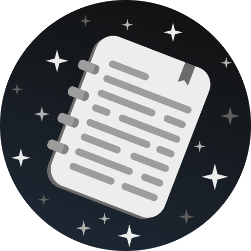
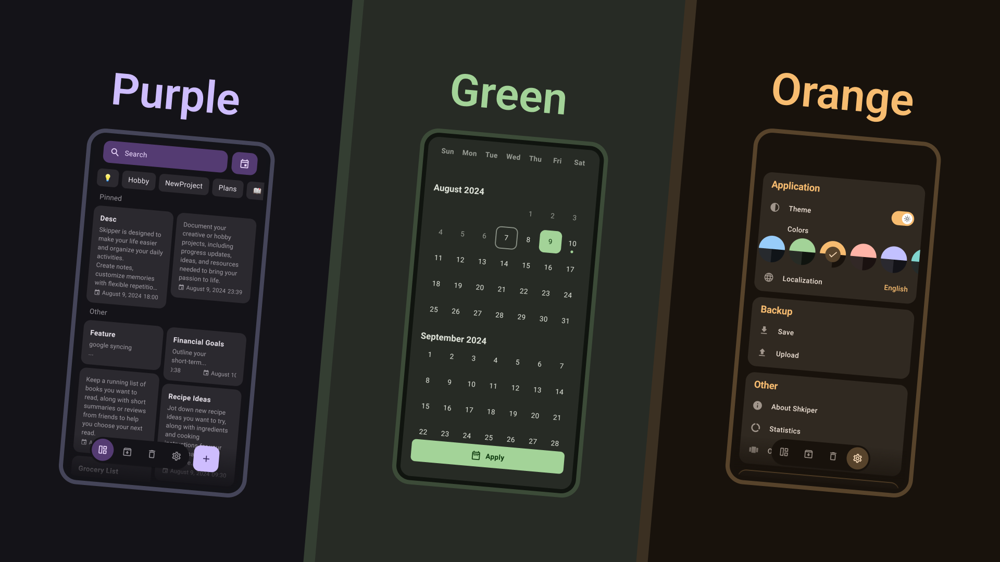

<h1 align="center">
    
    Shkiper
</h1>

 
 

 

## Description

The skipper is designed to make your life easier and organize your daily activities. Take notes, schedule reminders with
flexible repeat modes (daily, weekly, monthly, yearly) and don't forget important events.

### Key features

- Create notes and group them with tags for easy organization.
- View a preview of the links if they are in the note.
- Go back to similar actions when editing notes, so you don't lose anything.
- Customize the themes of the app to make it prestigious and customized to your style.
- Back up your data or download it for quick transitions.
- View application usage statistics, because it can be interesting.
- Convenient reminders for important occasions.
- Task calendar with all reminders and date range.
- Create widgets for quick access and viewing.
- Styling notes and text formatting.
- Ability to share a note and statistics as an image.

### App features

- Switch language (localization)
- Push notifications
- Custom color themes
- In-app updates
- In-app purchases
- Glance app widgets
- Image share
- Text formatting

 
    ⭐ Shkiper is still under development, if you have any questions or suggestions, please contact me! We value all of your feedback.

### Design & Screenshots

 
   

### Do you like this app? 💜

Support it by joining __[stargazers](https://github.com/Efimj/Shkiper/stargazers)__ for this repository. ⭐  

<a href="https://www.buymeacoffee.com/efim" target="_blank">Also, support me
with</a>